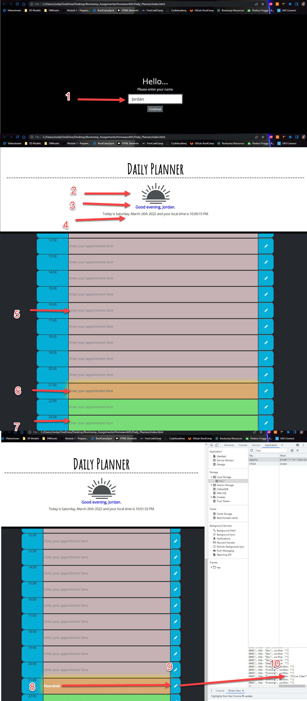

# Daily_Planner
## Homwork for bootcamp week 05 - the assignment is to create a daily planner that allows a user to save events for each hour of the day.

- The motivation for myself is to demonstrate what I have learned over the last month and demonstrate that I have built on my ability to use jquery, moment, and bootstrap while continuing to practice html, css, and basic javascript.
- Through this assignment I became much more familiar with JQuery syntax, Bootstrap syntax, and the ability to manipulate dom elements without changing the HTML directly.
- Also during this assignment I learned the hard way about scoping and ensuring variables I use often are globally scoped.
- Overall I dont think the assignment was daunting at first, but as usual, after diving in ideas came to me quickly and it was fun to work on.

## Website can be viewed here:

- https://aurafly.github.io/Daily_Planner/

## Usage

1. As the page loads, the user should see a front page asking for their name. Once entering and clicking continue it will load the main content.

2. Graphic will change depending on time of day.

3. Name will populate to have a more personalized feel, and greeting will chande depending on time of day.

4.  Local date and time should be shown for the user.

5. Past time-slots will have a different style depending on when the page is loaded.

6. Present time-slots will have a different style depending on when the page is loaded.

7. Future time-slots will have a different style depending on when the page is loaded.

8. Data can be entered into each time slot doesnt matter if its past, present, or future.

9. Data can be saved by clicking the save button next to the field that info was entered into.

10. Data is saved into local storage so that it can be loaded later as long as cache is not cleared.

## Credits
Jordan Covarrubias aka "AuraFly"
Some minor base code was provided for html and css, some of it was used, but a lot was either not used or restyled.

